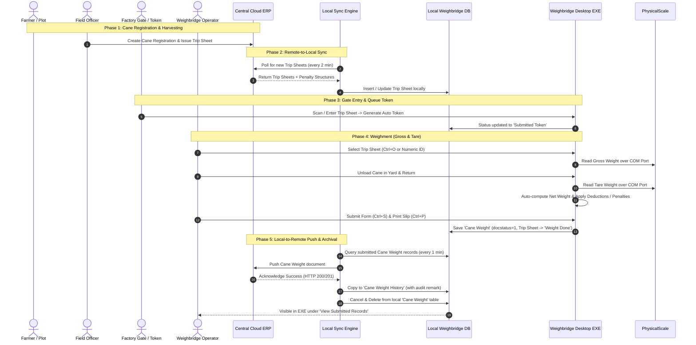
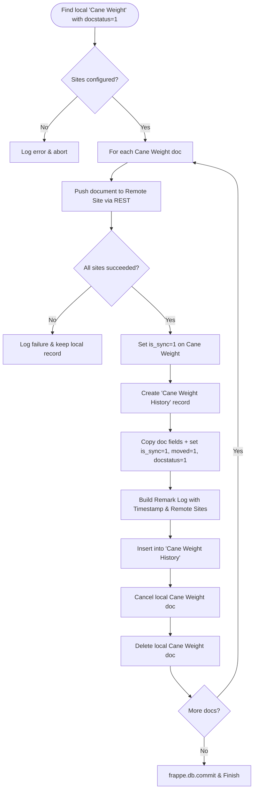

# Quantbit Agriculture CRM & Weighbridge Automation System

> **Kranti Sugar Weighbridge & Agriculture CRM Enterprise Suite**  
> A mission-critical, hybrid-tier sugar factory agriculture management and real-time weighbridge automation platform built on the **Frappe Framework** with a dedicated high-speed **PySide6 / PyQt Desktop EXE** client for industrial weighbridge scale terminals.

---

## Table of Contents

1. [Executive Summary & System Architecture](#1-executive-summary--system-architecture)
2. [End-to-End Operational Lifecycle & Data Flow](#2-end-to-end-operational-lifecycle--data-flow)
3. [The EXE Desktop Application (`main.py`)](#3-the-exe-desktop-application-mainpy)
   - [Overview & Technology Stack](#overview--technology-stack)
   - [Navigation & Primary Modules](#navigation--primary-modules)
   - [Cane Weight Form: Field Slip vs. Detailed Entry](#cane-weight-form-field-slip-vs-detailed-entry)
   - [Hardware Integration (Weighbridge Digital Indicator / COM Port)](#hardware-integration-weighbridge-digital-indicator--com-port)
   - [View Submitted Records & Cane Weight History Dialog](#view-submitted-records--cane-weight-history-dialog)
   - [Keyboard Shortcuts Reference](#keyboard-shortcuts-reference)
4. [Synchronization Engine (`sync.py`)](#4-synchronization-engine-syncpy)
   - [Dual-Tier Synchronization Architecture](#dual-tier-synchronization-architecture)
   - [Trip Sheet Pull: Remote to Local](#trip-sheet-pull-remote-to-local)
   - [Cane Weight Push & History Archival](#cane-weight-push--history-archival)
   - [Other Weight Push & Archival](#other-weight-push--archival)
   - [Scheduler Cron Jobs (`hooks.py`)](#scheduler-cron-jobs-hookspy)
   - [Audit Trails & The `remark` Sync Log](#audit-trails--the-remark-sync-log)
5. [DocTypes Directory & Schema Architecture](#5-doctypes-directory--schema-architecture)
6. [API & Remote Procedure Call (RPC) Layer (`exe_api.py`)](#6-api--remote-procedure-call-rpc-layer-exe_apipy)
7. [Installation, Build & Deployment Guide](#7-installation-build--deployment-guide)
   - [Frappe App Installation](#frappe-app-installation)
   - [Building the Windows EXE (`build.bat`)](#building-the-windows-exe-buildbat)
   - [Running on Linux via Wine / Native (`run_on_linux.sh`)](#running-on-linux-via-wine--native-run_on_linuxsh)
8. [Troubleshooting & Best Practices](#8-troubleshooting--best-practices)

---

## 1. Executive Summary & System Architecture

Sugar cane factories operate under intensive seasonal crushing campaigns spanning several months. During the peak harvest season, hundreds of tractor-trolleys, bullock carts, and trucks arrive at the factory gates 24 hours a day, 7 days a week. Any interruption in weighbridge operations halts the incoming cane supply and disrupts the factory's milling operations.

To guarantee zero downtime and real-time physical scale interaction, the platform uses a **hybrid dual-tier deployment**:

```
+-----------------------------------------------------------------------------------------+
|                                CENTRAL CLOUD FRAPPE ERP                                 |
|                     (Primary Database, Farmer Accounts, Field Planning)                 |
+-----------------------------------------------------------------------------------------+
                                   ▲                     │
              Scheduled Sync Push  │                     │  Scheduled Sync Pull
             (Cane Weights, Sales) │                     │  (Trip Sheets, Contracts)
                                   │                     ▼
+-----------------------------------------------------------------------------------------+
|                              LOCAL WEIGHBRIDGE STATION                                  |
|   +---------------------------------------+   +-------------------------------------+   |
|   |         Local Frappe Instance         |   |    Quantbit Cane Weighbridge EXE    |   |
|   | (Embedded MySQL / SQLite, Local Sync) |   |    (PySide6 / PyQt Desktop App)     |   |
|   +---------------------------------------+   +-------------------------------------+   |
|                       ▲                                          ▲                      |
|                       └──────── Local LAN / REST API ────────────┘                      |
|                                                                                         |
|                               Hardware Connection (RS-232 / USB)                        |
|                                          ▼                                              |
|                           [ Physical Weighbridge Scale Indicator ]                      |
+-----------------------------------------------------------------------------------------+
```

### Key Architectural Strengths

- **High Availability & Fault Tolerance**: Weighbridge terminals operate on local Frappe instances. Even if the factory's external internet connection drops, operators can continue weighing vehicles, creating auto tokens, and issuing printed weight receipts without pause.
- **Physical Scale Automation**: The desktop EXE connects directly to digital weighbridge indicators via RS-232 / Serial COM ports, eliminating manual weight tampering and transcription errors.
- **Bi-directional Background Synchronization**: Scheduled background cron workers continuously pull upcoming field trip sheets from the cloud ERP to the weighbridge terminals, and push finalized weighments back to the cloud for payroll, billing, and accounting.
- **Local Database Optimization (Archive & Purge)**: Finalized cane weighments that have successfully synced to the central cloud are archived into `Cane Weight History` with full audit logs and purged from active weighing tables, keeping local queries fast.

---

## 2. End-to-End Operational Lifecycle & Data Flow



### Detailed Lifecycle Phases

1. **Plot Survey & Cane Registration**: Farmers register cane plots in the cloud ERP, detailing season, crop variety, survey number, area in acres, and estimated yield.
2. **Trip Sheet Generation**: Harvesting & Transport (H&T) contractors are assigned to harvest specific fields. When a vehicle leaves the farm, a **Trip Sheet** is generated recording:
   - Farmer details & Cane Registration.
   - Transporter Contract & Harvester Contract (General / Gang types).
   - Vehicle Number, Cart/Trailer IDs (Cart 1, Cart 2, Trolly 1, Trolly 2).
   - Distance (km), Route, Flat Rate flags, and Deduction types.
3. **Background Ingestion to Weighbridge**: The local scheduler (`sync_trip_sheet_remote_to_local`) pulls submitted trip sheets down to the weighbridge local database every 2 minutes.
4. **Gate Entry & Auto Token**: Vehicles arrive at the factory gate. An **Auto Token** is issued, recording arrival timestamp, token number, and initial diesel allocation eligibility.
5. **Gross & Tare Weighment**:
   - First weighment: Vehicle enters the scale laden with sugar cane. Gross weight is captured directly from the scale indicator.
   - Vehicle unloads in the cane yard.
   - Second weighment: Empty vehicle re-enters the scale. Tare weight is captured.
6. **Automatic Deduction Calculation**:
   - **Binding Weight**: Automatic binding percentage calculated by vehicle type (e.g., Tractor vs. Bullock Cart).
   - **Farmer / Cane Deductions**: Percentage or fixed deductions applied according to crop quality or trash.
   - **Penalty Charges**: Automatic debit deductions applied across Farmer, Transporter, and Harvester entities.
7. **Submission & Status Shift**: Submitting the weighment transitions the Trip Sheet status from `Submitted Token` to `Weight Done`.
8. **Cloud Archival & Purge**: The background sync pushes the document to the remote cloud, archives it locally in `Cane Weight History`, and deletes it from `Cane Weight`.

---

## 3. The EXE Desktop Application (`main.py`)

### Overview & Technology Stack

The desktop client is a high-performance, single-window workstation application designed specifically for weighbridge operators.

- **GUI Framework**: PySide6 / PyQt5 with Qt Quick / Native Widgets.
- **Hardware Communication**: `pyserial` serial interface background listener thread.
- **Networking**: `requests` session pool with persistent authentication cookies and retry adapters.
- **Rendering & Print**: Qt Native Web / Browser Print Services for instant thermal slip and A4 printing.

---

### Navigation & Primary Modules

```
+----------------------------------------------------------------------------------------------------+
|  Kranti Sugar Cane Weighbridge                                                     [User] [Online] |
+----------------------------------------------------------------------------------------------------+
| [ Communication ] [ Settings ] [ Cane Weight ]* [ Cane Inward Slip ] [ Other Weight ]              |
+----------------------------------------------------------------------------------------------------+
|  [ Field Slip ]* [ Detailed Entry ]                                                                |
|  Trip Sheet: [ 00096 ] [Fetch]   Vehicle: [ MH23BH6712 ]   Farmer: [ Rohini Sachin Lad ]          |
|  Gross Weight: [ 10.00 ]  Tare Weight: [ 4.00 ]  Net Weight: [ 5.94 ]                              |
|  ------------------------------------------------------------------------------------------------  |
|  [ ✓ Submit (Ctrl+S) ]  [ ⎙ Print (Ctrl+P) ]  [ 📋 View Submitted Records (Ctrl+H) ]  [ ✗ Clear ]   |
+----------------------------------------------------------------------------------------------------+
```

1. **Communication Tab**:
   - Live monitor for serial weightbridge indicators.
   - Real-time display of incoming raw ASCII data frames, checksums, and parsed numeric values.
   - Port connection status (Connected / Disconnected / Error).
2. **Settings Tab**:
   - **Primary Server URL**: Local or Primary Frappe instance (`http://localhost:8000` or cloud endpoint).
   - **Secondary Server URL**: Standby / remote replication endpoint.
   - **Authentication Credentials**: Username, password, and session status test.
   - **Serial Port Configuration**: Port (e.g., `COM1`, `COM3`, `/dev/ttyUSB0`), Baud Rate (`1200` to `115200`), Data Bits, Parity (`None`, `Even`, `Odd`), Stop Bits.
   - **Manual Sync Utilities**: Instant trigger buttons for manual database synchronization.
3. **Cane Weight Tab** *(Default)*:
   - Primary weighing console featuring dual entry views: **Field Slip** and **Detailed Entry**.
4. **Cane Inward Slip Tab**:
   - Interface for searching, registering, and viewing Cane Inward Slips.
5. **Other Weight Tab**:
   - General weighbridge module for non-cane materials (Pressmud, Bagasse, Sugar, Lime, Coal, Scrap).
   - Supports multiline item tables, custom tare/gross weighing, and dedicated print layouts.

---

### Cane Weight Form: Field Slip vs. Detailed Entry

The Cane Weight form has two specialized inner sub-tabs:

#### 1. Field Slip (High-Speed Operator View)
- Designed for numeric-keypad-only operation.
- Operator enters the numeric suffix of the Trip Sheet (e.g., typing `96` automatically resolves to `TS/2627/00096`).
- Automatic pre-fill of Farmer Name, Village, Transporter, Harvester, Vehicle No., and Deduction types.
- Prominent Gross Weight, Tare Weight, and Net Weight readouts with live color coding.
- Single-key actions for Save, Submit, and Print.

#### 2. Detailed Entry (Comprehensive Audit View)
- Organized into collapsible panels:
  - **Basic Information**: Company, Season, Branch, Posting Date, Time, Factory Shift, Factory Day.
  - **Trip Sheet Details**: Trip Sheet ID, Cane Registration, Crop Variety, Crop Type, Survey Number, Acreage, Kisan Card status.
  - **Transporter & Harvester Details**: Transporter Contract, Transporter Code & Name, Gang Type, Route, Distance (km), Harvester Contract, Harvester Gang Type.
  - **Vehicle & Container Details**: Vehicle Type (Tractor / Truck / Bull Cart), Vehicle No, Trolly 1, Trolly 2, Cart 1, Cart 2, Rope Placement.
  - **Weight Calculations**: Gross Weight, Gross Timestamp, Tare Weight, Tare Timestamp, Net Weight, Binding Weight (kg/ton), Farmer Weight, Transporter Weight, Harvester Weight.
  - **Deduction Details**: Farmer Deduction Type, Cane Deduction Type, Deduction (%), Water Share (%), Cane Deduction Weight.
  - **Billing & Accounting**: DCP flag, Harvester Final Billing, Transporter Final Billing status.
  - **Penalty Charges Child Table**: Explicit rows detailing Entity Type (`Farmer`, `Transporter`, `Harvester`), Entity Code, Deduction Type, Deduction Method (`Percentage`, `Amount`, `Amount Per Ton`), Deduction Rate, Debit Account, Credit Account.

---

### Hardware Integration (Weighbridge Digital Indicator / COM Port)

The EXE features an asynchronous background serial listener:
- Continually polls the configured COM / Serial port without freezing the graphical user interface.
- Supports continuous stream indicators (e.g., Sartorius, Avery, Cardinal, Toledo, Eagle, local weight indicators).
- Parses ASCII weight strings using configurable regex / substring extractors (handles STX/ETX delimiters, leading sign, decimal places, and unit suffixes like `kg` or `ton`).
- Updates live weight widgets directly on the active form.

---

### View Submitted Records & Cane Weight History Dialog

Pressing **Ctrl+H** or clicking **📋 View Submitted Records** opens an interactive dialog:

```
+---------------------------------------------------------------------------------------------------------------------+
| Submitted Cane Weight Records                                                                             [ - + x ] |
+---------------------------------------------------------------------------------------------------------------------+
| Trip Sheet Name: [ All Trip Sheets                       ▼]  [ 🔍 Filter ]  [ ✖ Clear ]   Showing 150 record(s)     |
+---------------------------------------------------------------------------------------------------------------------+
| Name              | Season    | Branch | Trip Sheet     | Farmer             | Vehicle     | Cane Wt | Remark   | Print |
+---------------------------------------------------------------------------------------------------------------------+
| CW-TS/2627/00096  | 2026-2027 | Kundal | TS/2627/00096  | Rohini Sachin Lad  | MH23BH6712  | 5.94    | Synced.. | [Print|
| CW-TS/2627/00734  | 2026-2027 | Kundal | TS/2627/00734  | Ashok Patil        | MH10A1234   | 8.12    | Synced.. | [Print|
+---------------------------------------------------------------------------------------------------------------------+
|                                                                              [ Load Selected ]    [ Close ]         |
+---------------------------------------------------------------------------------------------------------------------+
```

- **Data Source**: Queries **`Cane Weight History`** (and dynamically merges any pending local un-synced submissions from `Cane Weight`), ensuring records remain visible before and after cloud synchronization.
- **Searchable Auto-Completing Filter**: Quick lookup by numeric trip sheet number or full ID.
- **Audit Remark Display**: Displays the synchronization timestamp, target cloud site, and archival notes.
- **Row Actions**:
  - Double-clicking or selecting and clicking **Load Selected** loads the historical weighment back into the form.
  - Clicking **Print** directly opens the Frappe Print View in the default browser.

---

### Keyboard Shortcuts Reference

| Shortcut | Action | Description |
| :--- | :--- | :--- |
| **Ctrl + S** | **Submit** | Validates and submits the active Cane Weight record (sets `docstatus=1`). |
| **Ctrl + D** | **Save Draft** | Saves changes as a Draft (`docstatus=0`). |
| **Ctrl + P** | **Print** | Opens the print preview for the current document. |
| **Ctrl + H** | **History / Submitted Records** | Opens the Submitted Cane Weight Records dialog. |
| **Ctrl + L** | **Clear Form** | Clears all input fields to prepare for the next vehicle. |
| **Ctrl + O** | **Slip Report** | Opens the Slip Details / Trip Sheet report dialog. |

---

## 4. Synchronization Engine (`sync.py`)

### Dual-Tier Synchronization Architecture

```
[ Remote Cloud Site Configuration ]
  url: https://uatkranti.quantcloud.in/
  user: admin@example.com
               │
               ▼ (HTTPS / Session REST)
     +-------------------+
     |      sync.py      |
     +-------------------+
        ▲             │
 (Every │      (Every │
  1 min)│       2 min)│
        │             ▼
  Push Weighments    Pull Trip Sheets
  to Remote Cloud    to Local DB
        │             │
        ▼             ▼
 [ Cane Weight ]  [ Trip Sheet ]
        │
   (On Success)
        ▼
 [ Cane Weight History ] (Remark logged)
        ▼
 Cancel & Delete local Cane Weight
```

---

### Trip Sheet Pull: Remote to Local

**Function**: `sync_trip_sheet_remote_to_local()`  
**Frequency**: Every 2 minutes (`*/2 * * * *`)

1. Connects to all remote sites defined in the `Site Configuration` DocType.
2. Authenticates using HTTP session pooling with automated retry handlers for HTTP 502/503/504 errors.
3. Calls remote endpoint `quantbit_agriculture_crm.exe_api.sync_trip_sheets`.
4. Retrieves new/modified trip sheets along with Auto Token metadata and penalty rules.
5. Performs bulk database lookup of existing IDs to minimize SQL roundtrips.
6. Strips remote metadata (`modified`, `creation`, `docstatus`) while preserving child tables.
7. Inserts new or updates existing local `Trip Sheet` records in atomic batches (`TRIP_SHEET_COMMIT_BATCH_SIZE = 20`).
8. Notifies the remote site of successfully synced IDs to avoid duplicate payload transfers.

---

### Cane Weight Push & History Archival

**Function**: `sync_cane_weight_to_remote()`  
**Frequency**: Every 1 minute (`*/1 * * * *`)



#### The History Archival Logic

```python
history_doc = frappe.new_doc("Cane Weight History")
for field, value in doc_dict.items():
    if field not in ("name", "moved"):
        history_doc.set(field, value)

history_doc.is_sync = 1
history_doc.moved = 1
history_doc.docstatus = 1

# Generate audit trail in remark field
sync_time = datetime.now().strftime("%Y-%m-%d %H:%M:%S")
site_names = ", ".join(s.name for s in sites)
sync_log = f"Cane Weight {doc.name} synced to remote ({site_names}) and moved to Cane Weight History on {sync_time}"
existing_remark = doc_dict.get("remark") or ""
history_doc.remark = f"{existing_remark}\n{sync_log}".strip() if existing_remark else sync_log

history_doc.insert(ignore_permissions=True)

# Purge local active record
if frappe.db.exists("Cane Weight", doc.name):
    doc_to_delete = frappe.get_doc("Cane Weight", doc.name)
    if doc_to_delete.docstatus == 1:
        doc_to_delete.cancel()
    frappe.delete_doc("Cane Weight", doc.name, ignore_permissions=True, ignore_missing=True)
```

---

### Other Weight Push & Archival

**Function**: `sync_other_weight_two()`  
**Frequency**: Every 5 minutes (`*/5 * * * *`)

- Follows the same push-and-archive pattern for non-cane weighments:
  1. Pushes submitted `Other Weight` documents and child item lines to remote instances.
  2. Archives the data into `Other Weight History`.
  3. Cancels and purges the local record from `Other Weight`.

---

### Scheduler Cron Jobs (`hooks.py`)

All scheduled background operations are declared in `hooks.py`:

```python
scheduler_events = {
    "cron": {
        "*/1 * * * *": [
            "quantbit_agriculture_crm.sync.sync_cane_weight_to_remote"
        ],
        "*/2 * * * *": [
            "quantbit_agriculture_crm.sync.sync_trip_sheet_remote_to_local"
        ],
        "*/5 * * * *": [
            "quantbit_agriculture_crm.sync.sync_other_weight_two"
        ],
        "0 */6 * * *": [
            "quantbit_agriculture_crm.sync.delete_old_error_logs",
            "quantbit_agriculture_crm.sync.delete_old_activity_logs"
        ]
    }
}
```

---

## 5. DocTypes Directory & Schema Architecture

| DocType | Type | Submittable | Description |
| :--- | :--- | :---: | :--- |
| **`Cane Weight`** | Transaction | Yes | Active weighing document recording Gross, Tare, Net weights and deductions. |
| **`Cane Weight History`** | Archive | Yes | Read-only permanent local archive of synced Cane Weight records with sync audit remarks. |
| **`Cane Weight Penalty Charges`**| Child Table | No | Deductions per entity (Farmer/Transporter/Harvester) attached to Cane Weight / History. |
| **`Trip Sheet`** | Master / Flow | Yes | Infield cane harvesting slip detailing farmer plot, contractors, distance, vehicle. |
| **`Trip Sheet Penalty Charges`** | Child Table | No | Penalty/deduction specifications configured on the Trip Sheet. |
| **`Auto Token`** | Transaction | Yes | Queue management token assigned to vehicles arriving at factory gates. |
| **`Auto Token Trip Sheet Details`**| Child Table| No | Child table linking one or more trip sheets to an Auto Token. |
| **`Other Weight`** | Transaction | Yes | Weighment for general factory materials (Pressmud, Bagasse, Sugar, Scrap). |
| **`Other Weight History`** | Archive | Yes | Permanent local archive of synced Other Weight records. |
| **`Other Weight Item`** | Child Table | No | Multi-item specification table for general weighbridge entries. |
| **`Site Configuration`** | Configuration | No | URL and authentication credentials for remote Frappe synchronization targets. |
| **`Season`** | Master | No | Cane crushing season master (e.g., `2026-2027`) controlling active operational dates. |
| **`Weight Settings`** | Configuration | No | Master configuration for serial weighbridge scale indicator protocols and ports. |
| **`Weight Settings Details`** | Child Table | No | Hardware configuration parameters (Baud rate, data bits, parity, stop bits). |
| **`Fuel Allocation Criteria`** | Configuration | No | Rules defining diesel allocations based on vehicle types, routes, and distances. |
| **`Factory Shift`** | Master | No | Working shifts (1st, 2nd, 3rd) and factory calendar day definitions. |
| **`Agriculture Settings`** | Configuration | No | Global application settings, defaults, and module parameters. |

---

## 6. API & Remote Procedure Call (RPC) Layer (`exe_api.py`)

The `exe_api.py` module exposes high-speed RPC endpoints optimized for the desktop client:

| Endpoint Method | Access | Purpose |
| :--- | :---: | :--- |
| `get_cane_weight_data(trip_sheet, season, ...)` | Whitelisted | Fetches trip sheet details, verifies token status, loads penalties, checks draft/submitted status. |
| `save_cane_weight_form(data)` | Whitelisted | Saves or updates a Cane Weight entry as a Draft (`docstatus=0`). |
| `submit_cane_weight_form(data)` | Whitelisted | Finalizes and submits a Cane Weight entry (`docstatus=1`), shifting Trip Sheet to `Weight Done`. |
| `save_other_weight_form(data)` | Whitelisted | Saves an Other Weight entry as Draft. |
| `submit_other_weight_form(data)` | Whitelisted | Submits an Other Weight entry. |
| `get_other_weight_records(...)` | Whitelisted | Retrieves submitted / draft other weight entries for list dialogs. |
| `get_other_weight_record(name)` | Whitelisted | Fetches full document dictionary for a specific Other Weight entry. |
| `sync_trip_sheets()` | Whitelisted | Central cloud endpoint returning trip sheets ready for local weighbridge ingestion. |
| `get_auto_token_trip_sheets(...)` | Whitelisted | Returns eligible trip sheets for gate token assignment. |
| `diesel_allocation_method(trip_sheet, ...)` | Whitelisted | Computes fuel quota eligibility based on vehicle type and token rules. |
| `get_binding_weight_percentage(vehicle_type)`| Whitelisted | Returns binding deduction percentages by vehicle classification. |

---

## 7. Installation, Build & Deployment Guide

### Frappe App Installation

```bash
# Navigate to your bench directory
cd ~/bench-weightbridge

# Get the app (if cloning fresh)
bench get-app quantbit_agriculture_crm

# Install the app onto your site
bench --site frontend.localhost install-app quantbit_agriculture_crm

# Run migrations to ensure all DocTypes and columns are up to date
bench --site frontend.localhost migrate

# Clear site cache
bench --site frontend.localhost clear-cache
```

---

### Building the Windows EXE (`build.bat`)

The repository includes a self-contained build script (`build.bat`) for Windows:

1. Copy the project folder to a Windows machine.
2. Double-click **`build.bat`**.
3. The script automatically:
   - Detects or installs Python 3.12 (via `winget` if missing).
   - Creates a dedicated virtual environment in `.venv-build`.
   - Installs build dependencies: `PySide6`, `pyserial`, `requests`, `pyinstaller`.
   - Runs PyInstaller with [`QuantbitCaneWeighbridge.spec`](file:///home/erpadmin/bench-weightbridge/apps/quantbit_agriculture_crm/QuantbitCaneWeighbridge.spec).
   - Generates the standalone executable: **`dist\QuantbitCaneWeighbridge.exe`**.
   - Creates a ready-to-use shortcut on the operator's Desktop.

---

### Running on Linux via Wine / Native (`run_on_linux.sh`)

For development, testing, or Linux-based weighbridge terminals, execute `run_on_linux.sh`:

```bash
# Make script executable
chmod +x run_on_linux.sh

# Build and launch under Wine (creates an isolated prefix in .wine-quantbit)
./run_on_linux.sh

# Command line options:
./run_on_linux.sh --rebuild      # Force a fresh PyInstaller build
./run_on_linux.sh --build-only   # Build the EXE without launching GUI
./run_on_linux.sh --clean        # Purge temporary build artifacts
```

Alternatively, to run natively on Linux using system Python:

```bash
source env/bin/activate
pip install PySide6 pyserial requests
python3 main.py
```

---

## 8. Troubleshooting & Best Practices

### 1. Serial Port Communication Issues
- **Symptom**: Scale reading displays `0.00` or `COM Port Disconnected`.
- **Resolution**:
  - In the **Settings** tab, verify the assigned port (e.g., `COM1` on Windows or `/dev/ttyUSB0` on Linux).
  - Verify that the operator account has read/write permissions to serial devices (`sudo usermod -aG dialout $USER` on Linux).
  - Inspect the **Communication** tab to verify that raw ASCII bytes are arriving from the scale indicator.

### 2. Missing Submitted Records in the EXE
- **Symptom**: Records disappear after submission.
- **Explanation**: This is expected behavior by design. Finalized cane weighments are pushed to the cloud and archived locally into **`Cane Weight History`**.
- **Resolution**: Open **Ctrl+H** (**📋 View Submitted Records**). The dialog queries `Cane Weight History` and displays all archived weighments along with their sync timestamps and audit remarks.

### 3. Synchronization Latency or Connection Errors
- **Symptom**: Local records are not appearing on the central cloud server.
- **Resolution**:
  - Check the Frappe Error Log (`Desk > Error Log List`) for entries titled `Cane Weight Sync Error`.
  - Verify network connectivity to the target URL in the **`Site Configuration`** DocType.
  - Test credentials by logging into the remote site directly in a web browser.
  - Ensure the Frappe scheduler is running:
    ```bash
    bench --site frontend.localhost enable-scheduler
    bench doctor
    ```

---

## License

This software is licensed under the **MIT License**. See `license.txt` for details.
